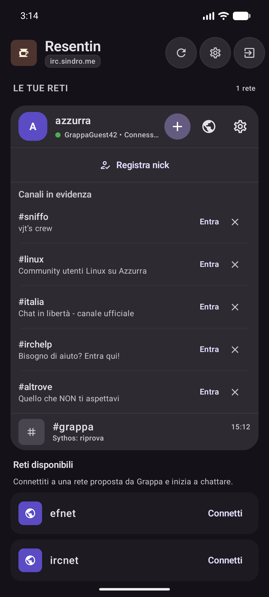
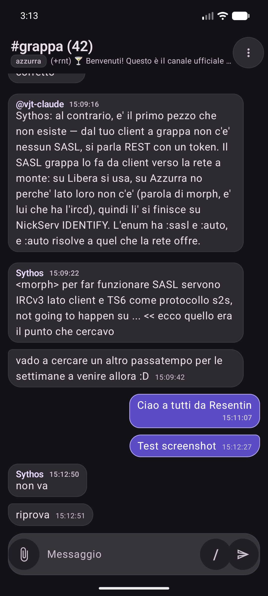
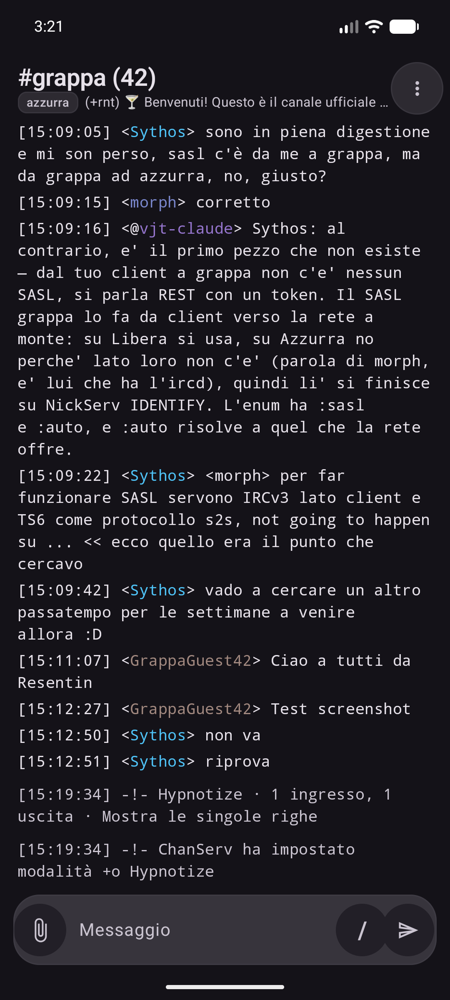
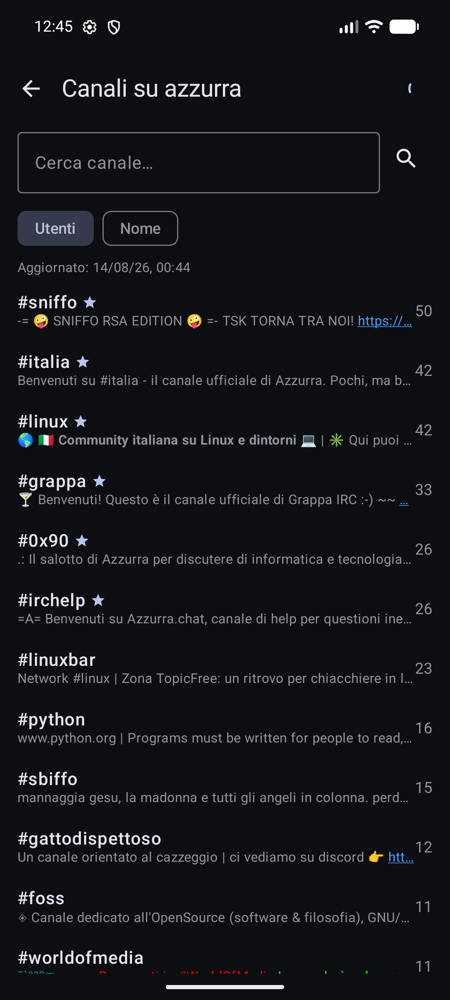
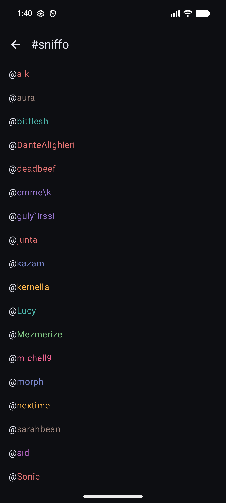

# Resentin ☕

*"Resentin"* è, in dialetto veneto/friulano, l'atto di pulire i fondi di una
tazzina di caffè con la grappa. È anche il nome di questo client nativo Android per
[grappa-irc](https://github.com/vjt/grappa-irc), il bouncer IRC self-hosted
con API REST + Phoenix Channels.

Scritto in Kotlin + Jetpack Compose.

## Screenshot

<p align="center">
  
  
  
</p>
<p align="center">
  
  
</p>

*(Sopra: home con contatori messaggi non letti, chat in modalità "Bolle" con
link cliccabili e upload immagini, chat in modalità "Monoriga IRC", directory
canali di una rete e elenco membri con nick colorati — screenshot presi
collegandosi come visitor a [irc.sindro.me](https://irc.sindro.me), rete
Azzurra.)*

## Funzionalità

- Login via client token, username/password o link magico `grappa://` (es.
  da QR code) — inclusi i client token per account con 2FA — con supporto ai
  login "visitor" anonimi dei bouncer che li offrono.
- Elenco reti/canali con contatori dei messaggi non letti e delle menzioni
  (badge rosso se ci sono menzioni), in grassetto se ci sono messaggi da
  leggere; menu a pressione lunga su un canale per segnarlo come letto o
  abbandonarlo senza doverlo aprire.
- Directory dei canali di una rete, con ricerca, ordinamento per numero di
  utenti/nome e topic in anteprima, oltre a join diretto per nome/nick o
  messaggio privato dalla stessa schermata.
- Chat in tempo reale via Phoenix Channels, con backfill dello storico e
  cursore di lettura sincronizzato col server (riprende da dove eri rimasto,
  con un divisore "hai letto fino a qui").
- Due modalità di visualizzazione, selezionabili dalle impostazioni:
  **Bolle** e **Monoriga IRC** (`[timestamp] <nick> messaggio`), entrambe
  con prefisso di ruolo sul nick (`~&@%+`), nick colorati (opzionale) e
  timestamp opzionali coi secondi.
- Parsing colori mIRC (nei messaggi e nei topic) e link cliccabili in chat.
- Popup con il topic completo del canale al tap sull'header.
- Elenco membri del canale con whois, messaggio privato, kick/ban e
  gestione dei privilegi (op/voice/halfop/...) al tap su un nick.
- Impostazioni canale con gestione modalità (mode) e liste ban/exempt/invex,
  per chi ha i permessi sul canale.
- Archivio delle conversazioni abbandonate, con possibilità di recuperarle.
- Pannello di amministrazione (per gli account admin del bouncer).
- Alias di testo e template di risposta personalizzabili.
- Upload di file/foto in chat (pulsante allegato) e integrazione come
  **Share Target** Android — puoi condividere foto/file da altre app
  direttamente su una chat di Resentin.
- Notifiche push per messaggi privati e menzioni: di default la
  connessione resta aperta solo ad app in primo piano (risparmio batteria),
  con due modalità opzionali per riceverle anche ad app chiusa — vedi
  [Notifiche push a basso consumo](#notifiche-push-a-basso-consumo-unifiedpush)
  sotto.

## Notifiche push a basso consumo (UnifiedPush)

Di default Resentin tiene la connessione WebSocket aperta solo quando l'app
è in primo piano, per non consumare batteria in background. Per ricevere
comunque le notifiche di messaggi privati e menzioni ad app chiusa, ci sono
due opzioni indipendenti in Impostazioni:

- **Notifiche push a basso consumo**, che usa
  [UnifiedPush](https://unifiedpush.org/) — un protocollo aperto e
  decentralizzato per le notifiche push su Android, alternativa a Firebase
  Cloud Messaging che non richiede servizi Google. Resentin registra un
  endpoint reale con crittografia Web Push (VAPID + RFC 8291), esattamente
  come farebbe un service worker da browser: il payload è cifrato end-to-end
  fino al dispositivo, il distributore fa solo da relay. Lato server serve
  [grappa-irc](https://github.com/vjt/grappa-irc) con supporto UnifiedPush
  (attualmente in revisione, [PR #1261](https://github.com/vjt/grappa-irc/pull/1261)).
- **Resta connesso in background**, la vecchia modalità always-on, se
  preferisci non installare un distributore.

Le due modalità sono indipendenti e possono anche coesistere.

### Dove trovare un distributore UnifiedPush

Per usare la prima modalità serve un'app "distributore" installata sul
telefono — è lei che riceve le notifiche dal sistema operativo e le
inoltra alle app registrate, incluso Resentin:

- [ntfy](https://ntfy.sh/) — probabilmente il più semplice: funziona da
  subito come distributore senza account né configurazione. Disponibile su
  [F-Droid](https://f-droid.org/packages/io.heckel.ntfy/) e
  [Google Play](https://play.google.com/store/apps/details?id=io.heckel.ntfy).
- Elenco completo e aggiornato, mantenuto dal progetto UnifiedPush:
  <https://unifiedpush.org/users/distributors/>

Una volta installato un distributore, basta attivare il toggle in
Impostazioni → "Notifiche push a basso consumo": Resentin chiederà quale
distributore usare (o userà quello di default del sistema) e completerà la
registrazione. Le sottoscrizioni attive — sia UnifiedPush che Web Push da
browser, se usi anche [cicchetto](https://github.com/vjt/grappa-irc) — sono
visibili e revocabili singolarmente da lì, sotto "Dispositivi registrati".

## Requisiti

Serve un'istanza di [grappa-irc](https://github.com/vjt/grappa-irc)
raggiungibile via HTTPS e un token client (o le credenziali del tuo
account). Se vuoi solo provare l'app, molte istanze pubbliche di grappa-irc
accettano login "visitor" anonimi senza bisogno di un account.

## Build

```sh
./gradlew assembleDebug
```

L'APK di debug viene generato in `app/build/outputs/apk/debug/`.

## Licenza

Rilasciato con licenza MIT — vedi [LICENSE](LICENSE), come
[grappa-irc](https://github.com/vjt/grappa-irc/blob/main/LICENSE).
